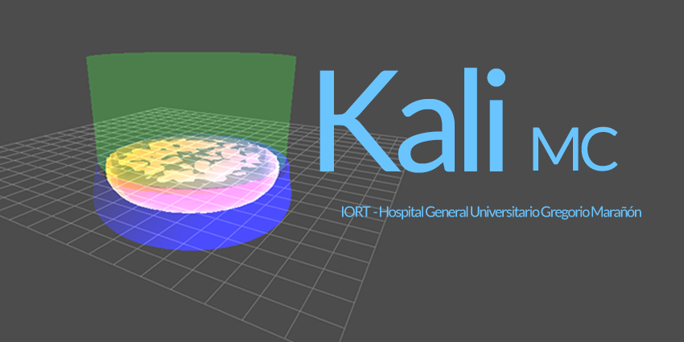

  

**Software for calculating IORT treatments with a LIAC HWL linac, based on precalculated Monte Carlo dose distributions in water.**

## Main Features:
- Visualize absorbed dose distributions of all combinations of applicators and energies
- Calculate monitor units (MU) with measured output factors at zmax
- Pressure correction available
- Rescaling factors can be added for desired combinations
- Report generation in pdf
- Send data as RTPlan to Record and Verify software (only tested with MOSAIQ)

## Limitations:
- The software is intended for educational purposes
- The Monte Carlo model was fitted to the data accquired at Gregorio Marañón hospital, Madrid.
  Different linacs may show dosimetric differences.

## Documentation:
[https://kali-mc.readthedocs.io/](https://kali-mc.readthedocs.io/)
