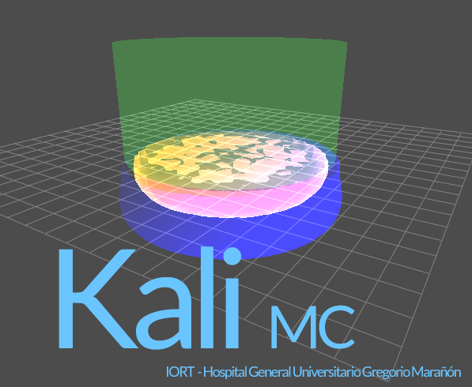

Welcome to Kali MC's documentation!
===================================
.. image:: https://readthedocs.org/projects/kali-mc/badge/?version=latest
    :target: https://kali-mc.readthedocs.io/en/latest/?badge=latest
    :alt: Documentation Status

**Kali MC** is a Python application for calculating IORT treatments with a LIAC HWL linac, based on pre-calculated Monte
Carlo dose distributions in water.

.. _splash_kali:

|

.. note::

   This project is under active development.

.. warning::

   The software is intended for educational purposes. The end user is responsible for verifying the different
   dosimetric characteristics of their unit.

Contents
--------

.. toctree::

   starting
   usage
   local_conf
   license
