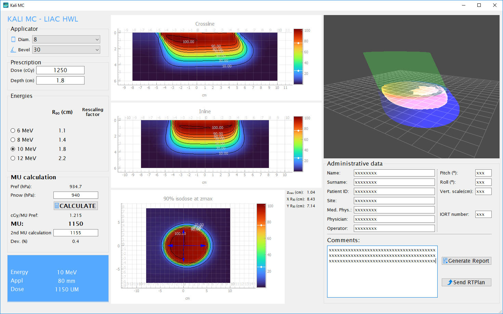
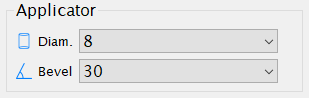
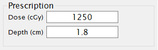
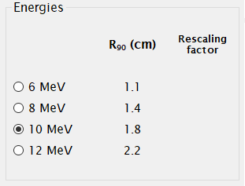
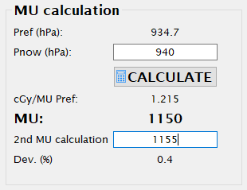
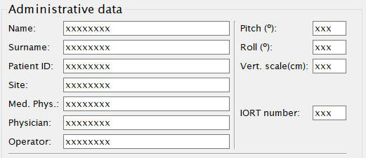
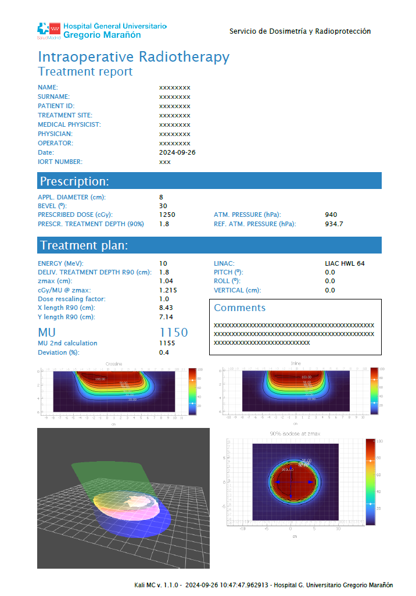
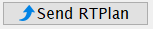

Usage
======
This section describes the general usage of the software.
Follow the next subsections to calculate a treatment, generate a report and send it to a R&V system  with Kali MC.

.. _kali-screemshot:

|

The software shows absorbed dose distributions in water, pre-calculated with penEasy 2020 :footcite:p:`sempauPENELOPEbasedSystemAutomated2011`,
based in PENELOPE 2018 :footcite:p:`nuclearenergyagencyPENELOPE2018Code2019`.

Applicator
-------------
Choose between the available applicator diameters (3, 4, 5, 6, 7, 8, 9, 10 and 12 cm) and bevel endings (0º, 15º, 30º and
45º).

.. _kali-applicator:

|

Prescription
-------------
Enter the prescribed dose in cGy and the desire depth in cm (depth of the 90% isodose).

.. _kali-prescription:

|

Energy selection
-----------------
Choose the desired energy comparing its R\ :sub:`90` \ with the prescribed treatment depth.

.. _kali-energies:

|

.. note::
    If rescaling factors are enabled in ``local_conf.py``, the associated factors will show next to the R\ :sub:`90` \
    values.

MU calculation
-----------------
Once the diameter, bevel of the applicator, and the desired energy are selected, it is necessary to enter the current
atmospheric pressure in hPa.
This is required because the monitor system of the linac does not perform pressure correction, and undesirable output
deviations can occur if this correction is not made.

For that purpose, the atmospheric pressure at the time of the equipment calibration (P\ :sub:`ref` \) must be recorded.

.. note:: You can modify this parameter customizing the configuration file, ``local_conf.py`` (see the :doc:`local_conf`
    section).

The following expression is used for calculating Monitor Units:

.. math::
   UM = round(\frac{D * P_{now} * f_{resc}} {cGy/UM * (iso_{presc} / 100) * P_{ref}})

where:

D
    Prescribed Dose in cGy
P\ :sub:`now`\
    Current atmospheric pressure (hPa)
f\ :sub:`resc`\
    Rescaling factor, if activated, otherwise f\ :sub:`resc`\=1
cGy/UM
    Output factor at z\ :sub:`max` \ for the current applicator and energy combination in cGy per MU.
iso\ :sub:`presc`\
    Prescription relative isodose, non-editable, **90%** isodose.
P\ :sub:`ref`\
    Atmospheric pressure (hPa) at calibration time.

.. _kali-calculation:

|

If a second calculation has been performed (hand calculation or with a different software), the result can be entered,
and a deviation will be calculated as a quotient between the two values, expressed in percentage.

Dose distributions
-------------------
The software shows dose planes with relative isodose levels in the crossline and inline directions, as well as in a
coronal plane at the depth of z\ :sub:`max` \ of the selected energy/applicator. When inclined applicators are
selected, the major axis is aligned along the crossline direction.

Additionally, there is a 3D view of the applicator and the isodoses at 20%, 90%, and 105%.

All dose distributions are normalized to the absorbed dose at z\ :sub:`max` \ in the clinical axis.

Crossline
    .. _kali-crossline:
    .. image:: figures/kali-crossline.png
        :align: center
        :width: 500

Inline
    .. _kali-inline:
    .. image:: figures/kali-inline.png
        :align: center
        :width: 500

Coronal at z\ :sub:`max` \
    .. _kali-coronal:
    .. image:: figures/kali-coronal.png
        :align: center
        :width: 400

3D
    .. _kali-3D:
    .. image:: figures/kali-3D.png
        :align: center
        :width: 400

Report generation
-------------------
A PDF report can be generated; for this purpose, some administrative data must be provided:

.. _kali-administrative:

|

Press the *Generate report* button:

.. _kali-report-button:

|

Use the save file dialog to choose the destination path of the pdf file.

.. note:: The default path for saving reports can be customize in the ``local_conf.py`` file, see the :doc:`local_conf`
    section.

A report will be generated with the treatment data:

.. _kali-report:

.. note:: The institution logo and department name can be customized in the ``local_conf.py`` file, see the :doc:`local_conf`
    section.

Send plan to R&V systems
------------------------
The prescription and treatment parameters can be sent to a Record and Verify system as a DICOM RTPlan object.
The following items need to be configured in the ``local_conf.py`` file:

* destination_server
* destination_AETitle
* destination_port

If exporting to Elekta Mosaiq, the machine name in Mosaiq must match the exported name. You can modify this using the machine
parameter:

* machine

Additionally, Mosaiq attempts to match tolerance tables when importing a plan. While this is not strictly necessary,
it can simplify the import process. You can modify tolerances with the following parameters:

* tol_table_ID
* tol_table_label

Once the administrative data is filled and the server is configured in the ``local_conf.py`` file, the exportation is
done by pressing the *Send RTPlan* button:

.. _kali-send-button:

|

.. note:: The applicator names are sent as `C10B0`, `C3B45`... In order to map them in Mosaiq, they have to be defined
    in the machine characterization.

.. footbibliography::
